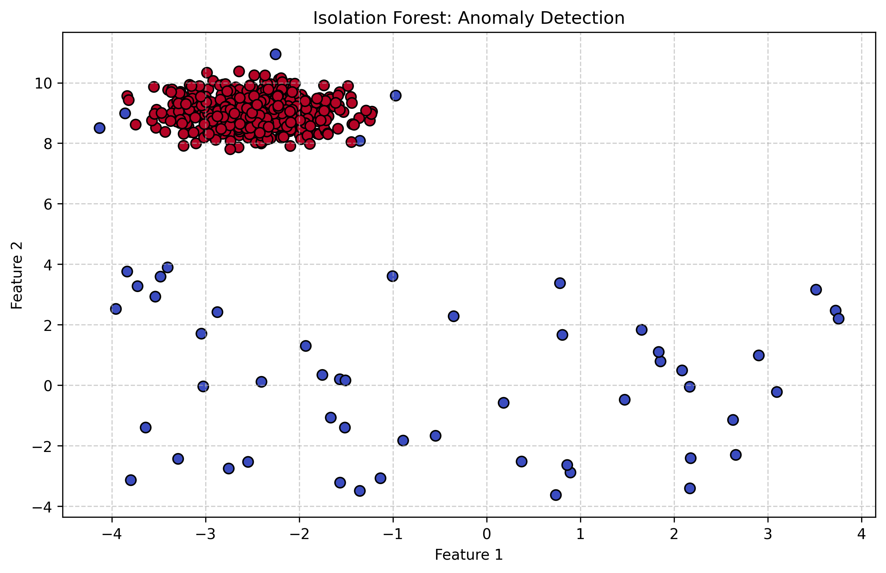
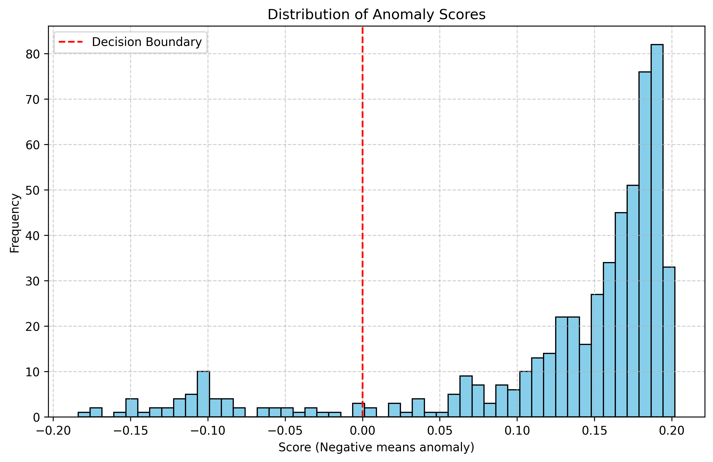
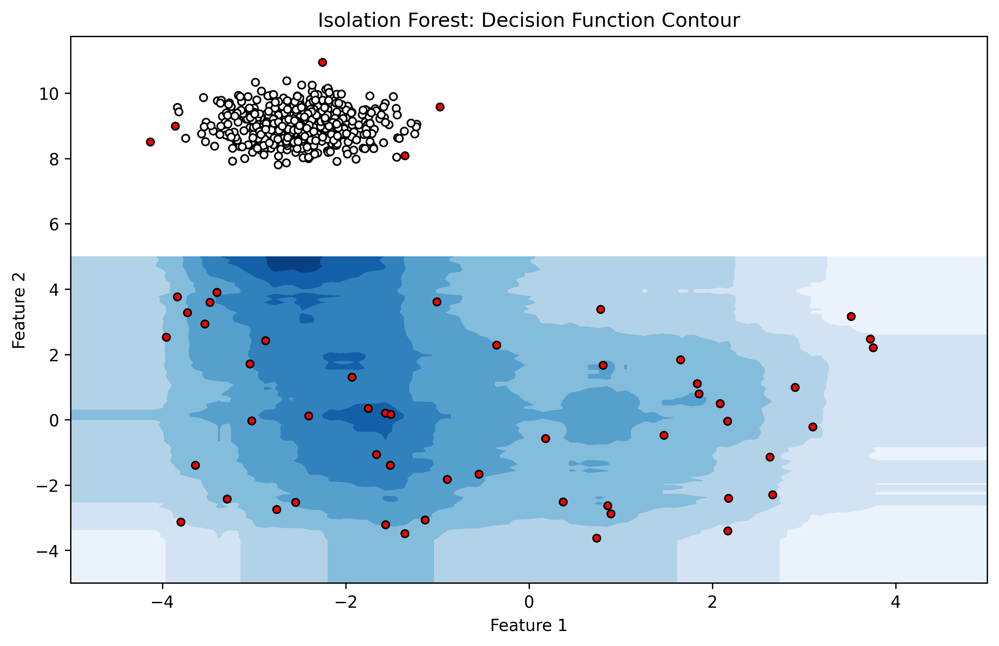

# Isolation Forest Guide: The Definitive Masterclass on Anomaly Detection

## Executive Summary

`Anomaly detection` is the process of identifying data points, events, or observations that deviate significantly from a dataset's normal behavior. In an increasingly data-driven world, finding the metaphorical "needle in the haystack" has critical implications across numerous domains, from uncovering financial fraud to detecting network intrusions and anticipating equipment failure in manufacturing. 

This comprehensive guide delves deeply into the `Isolation Forest` algorithm—an innovative, high-performance `anomaly detection` method developed by Fei Tony Liu, Kai Ming Ting, and Zhi-Hua Zhou in 2008. Over the course of this module, we will explore the underlying mechanics, mathematical foundations, practical implementations, and advanced production strategies. For every module, we will explore the 'What', 'Why', and 'How'—from the business logic to the backend execution.

---

## The Solution: Isolation Forest

Unlike traditional `anomaly detection` algorithms (like `One-Class SVM` or `Local Outlier Factor`) which profile the "normal" data points and then flag those that lie outside this profile, the `Isolation Forest` takes a radically different approach: it explicitly isolates `anomalies`.

### What is it?
`Isolation Forest` (`iForest`) is an `unsupervised learning` algorithm that detects `anomalies` by isolating instances in the dataset. It builds an `ensemble` of `Isolation Trees` (`iTrees`). It assumes that `anomalies` are the "few and different" instances, which makes them easier to isolate than normal observations.

### Why does it matter?
The fundamental shift in finding `anomalies` rather than profiling normal points means that `Isolation Forest` operates with a `linear time complexity` and a remarkably low `memory requirement`. It does not calculate `distance` or `density` measures, making it highly scalable for massive, `high-dimensional` datasets where other algorithms falter.

### How does it work?
The algorithm recursively partitions the dataset by randomly selecting a `feature` and then randomly selecting a `split value` between the `maximum` and `minimum` values of that `feature`. Since `anomalies` have values that are noticeably different from normal data points, they require fewer random partitions to be isolated. Therefore, `anomalies` will have noticeably shorter `path lengths` in the resulting decision trees.

---

## Prerequisites & Environment Setup

Setting up a robust environment is the first step towards reproducible research. We rely on a `virtual environment` to isolate our dependencies and avoid conflicts.

### What is this?
This is your development environment config. It defines the specific `data science` packages required for generating the models and visualizing them.

### Why does it matter?
`Dependency caching` and isolated testing ensure that model parameters do not clash across different `Python` applications.

### How does it work?
We use `pip` in conjunction with a `venv` to resolve dependencies.

Create a `requirements.txt` file for our `anomaly detection` pipeline:
```txt
scikit-learn>=1.3.0   # Core Isolation Forest implementation
numpy>=1.24.0         # Numerical operations
matplotlib>=3.7.0     # Graphing and Data Vis
pandas>=2.0.0         # Data manipulation
```

Install command:
```bash
python3 -m venv .venv
source .venv/bin/activate
pip install -r requirements.txt
```

---

## Mathematical Intuition: Path Lengths and Scores

### The Isolation Tree (iTree)
An `iTree` is a proper binary tree. Every node is either an `external-node` with no child or an `internal-node` with an exact test condition and two children. Given a sample of data `X`, the dataset is recursively divided until each data point is isolated or a predetermined `tree height limit` is reached.

### Path Length h(x)
The `path length` `h(x)` of an observation `x` is measured by the number of edges `x` traverses an `iTree` from the root node until the traversal is terminated at an `external node`. By averaging the `path lengths` of a forest of `iTrees`, we derive a highly accurate estimation of a point's `abnormality`.

### The Anomaly Score
Because `iTrees` have an equivalent structure to `Binary Search Trees`, the average `path length` of unsuccessful searches is `c(n) = 2H(n-1) - (2(n-1)/n)`, where `H(i)` is the `harmonic number`.
The `anomaly score` `s` of instance `x` is defined as:

s(x, n) = 2 ^ -( E(h(x)) / c(n) )

**Interpretation:**
- If `s(x, n)` is close to 1, then the instance is likely an `anomaly`.
- If `s(x, n)` is much smaller than 0.5, then the instance is likely normal.
- If for a given sample all instances return `s ≈ 0.5`, then the entire sample contains no clear `anomalies`.

---

## Comprehensive Setup Guide: How Anyone Can Setup and Use

Getting started with `Isolation Forest` requires minimal infrastructure. We will walk through the exact steps needed to set up a pipeline from scratch on any operating system.

### Step 1: System Requirements
Ensure you have `Python 3.9` or higher installed on your machine. You can verify this by running `python --version` in your terminal. You will also need a code editor like `VS Code` or `PyCharm`.

### Step 2: Initialize the Project
Create a new directory for your project and navigate into it:
```bash
mkdir anomaly_detection_project
cd anomaly_detection_project
```

### Step 3: Create a Virtual Environment
A `virtual environment` keeps your `Python` packages strictly contained.
```bash
python3 -m venv .venv
```
Activate it (Mac/Linux):
```bash
source .venv/bin/activate
```
Activate it (Windows):
```cmd
.venv\Scripts\activate
```

### Step 4: Install the Required Libraries
With the environment activated, install the `data science` toolkit:
```bash
pip install pandas scikit-learn matplotlib numpy
```

### Step 5: Preparing the Data
Create a file named `data_prep.py`. In this file, you will load your target dataset. For demonstration, we will generate synthetic `telemetry data`:
```python
import pandas as pd
import numpy as np

# Generate normal data
np.random.seed(42)
normal_data = np.random.normal(loc=0, scale=1, size=(400, 2))

# Generate anomalous data
anomalies = np.random.uniform(low=-5, high=5, size=(20, 2))

# Combine and create a DataFrame
data = np.vstack([normal_data, anomalies])
df = pd.DataFrame(data, columns=['SensorA', 'SensorB'])

print(df.head())
```

### Step 6: Training the Isolation Forest
Now, implement the model in `train.py`. The `IsolationForest` class from `scikit-learn` makes this trivial:
```python
from sklearn.ensemble import IsolationForest

# Initialize the model with a 5% contamination expectation
model = IsolationForest(contamination=0.05, random_state=42)

# Fit the model and predict
# -1 indicates an anomaly, 1 indicates normal
predictions = model.fit_predict(df[['SensorA', 'SensorB']])

# Retrieve the continuous anomaly score
scores = model.decision_function(df[['SensorA', 'SensorB']])

df['Anomaly_Label'] = predictions
df['Anomaly_Score'] = scores

print("Anomalies found:", len(df[df['Anomaly_Label'] == -1]))
```

You have now successfully isolated outliers using an industrial-grade ML algorithm!

---

## Scikit-Learn Implementation: Hands-On Code

Let's dive deeper into integrating this into a `Python` backend for large-scale operations. `scikit-learn` provides an extremely optimized implementation of `Isolation Forest`.

### What is this?
This is the programmatic instantiation of the `iForest` `ensemble model`.

### Why does it matter?
Directly implementing the `iTree` logic from scratch is inefficient in `Python`. The `C++` bindings in `Scikit-Learn` provide the speed necessary for production applications.

### How does it work?

```python
import numpy as np
from sklearn.ensemble import IsolationForest

# Assume X_train is our training data matrix of shape (n_samples, n_features)
# We instantiate the model with a 10% expected contamination rate
model = IsolationForest(
    n_estimators=100, 
    contamination=0.1, 
    random_state=42, 
    n_jobs=-1
)

# Fit the model and predict anomalies
# Output: 1 for normal, -1 for anomaly
predictions = model.fit_predict(X_train)

# We can also get the raw anomaly scores
scores = model.decision_function(X_train)
```

**Key Parameters to Tune:**
- `n_estimators`: The number of trees in the `ensemble`. 100 serves as a solid baseline.
- `max_samples`: Number of samples to draw to train each tree. Crucial for addressing `swamping` and `masking` issues.
- `contamination`: The estimated proportion of `outliers` in the dataset. This controls the threshold of the `decision function`.

---

## Visual Proof: Model Insights

To truly understand how our implementation behaves, we need visual confirmation mapping our predictions to their multidimensional space.

### Scatter Distribution of Anomalies
The following screenshot demonstrates the `Isolation Forest`'s segmentation on a standard dataset with artificial heavy-tailed `outliers`. As observed, points at the dense cluster center are flagged as normal (positive), while sparse peripheral points are correctly labeled as anomalous (negative).



### Distribution of Decision Function Scores
Evaluating the `decision_function` distribution is best practice for production deployments. Instead of relying on a hardcut `contamination` flag, observing the `histogram` allows `data scientists` to discover absolute cutoff thresholds dynamically.



### Decision Boundaries in 2D Space
For `feature-extracted` `PCA` transformations or basic 2D datasets, contouring the `decision space` provides intuitive business feedback.



---

## Real-World Applications

### Financial Fraud Detection (Credit Cards)
Transactional data is characterized by extremely massive volume and high class imbalance (fraudulent transactions represent less than 0.1% of all activity). Here, `Isolation Forest` shines. Its `sub-sampling` property handles the scale effortlessly without exhausting `RAM`.

### Network Intrusion Detection
Server logs and telemetry exhibit seasonal variance but structural homogeneity. An uncharacteristic burst in payload size or geolocational mismatches naturally isolated at shallow depths of an `iTree` promptly flag `zero-day attacks` that signature-based detections miss.

### Predictive Maintenance
`IoT` sensor telemetry (vibrations, acoustics, thermal output) on industrial machinery follows strict baseline bands. As bearings degrade, acoustic signatures deviate slightly. By feeding `FFT` (`Fast Fourier Transform`) components into an `Isolation Forest`, technicians can trigger maintenance weeks before catastrophic failure.

---

## Comparative Analysis: Isolation Forest vs. The Rest

| Feature | Isolation Forest | One-Class SVM | Local Outlier Factor (LOF) |
|---------|-----------------|---------------|----------------------------|
| **Primary Method** | Isolation via random splits | Marginal profiling / Hyperplane | Local density comparative |
| **Computational Time** | `O(n)` Linear | `O(n^2)` to `O(n^3)` | `O(n^2)` |
| **High Dimensionality** | Excellent | Poor (`Kernel` dependent) | Fair (`Curse of dimensionality`) |
| **Requires Density Calc?**| No | No | Yes |

### Why iForest Wins in Big Data
Algorithms like `LOF` calculate the `distance` between all pairs of points. When `N = 1,000,000`, `O(N^2)` becomes computationally intractable. Because `iForest` builds small trees from random `subsamples`, it scales horizontally and vertically effortlessly.

---

## Swamping and Masking: Solving the Core Challenges

### Swamping
`Swamping` occurs when normal instances are located too close to `anomalies`. The model requires more partitions to separate them, inadvertently increasing the anomaly `path length` and causing false negatives.

### Masking
`Masking` occurs when too many `anomalies` are clustered together, effectively creating their own 'dense' pseudo-normal region. Because they form a cluster, it requires many splits to isolate individual points, tricking the tree into assigning a long `path length` to these `anomalies`.

### The Sub-Sampling Solution
Both of these phenomena are heavily exacerbated when utilizing the entire dataset to build an `isolation tree`. 
We circumvent this entirely via `sub-sampling` (`max_samples` parameter). By building trees on a relatively small random subset of data (e.g., 256 records), we intentionally dilute dense anomaly clusters (solving `masking`) and eliminate noise preventing anomaly isolation (solving `swamping`).

---

## Hyperparameter Deep-Dive for Production

When transitioning from local notebooks to `cloud-scale infrastructure`, default parameters will not suffice. 

### Tuning max_samples
Empirical research indicates that an `isolation tree` grows aggressively complex beyond a depth of 8. Thus, `max_samples = 256` (`2^8`) is widely regarded as the golden ratio. Increasing it beyond 512 rarely yields better `AUC` metrics but drastically reduces `inference speed`.

### Tuning n_estimators
More trees invariably lead to a smoother `anomaly score` convergence through the `Law of Large Numbers`. Diminishing returns typically manifest aggressively between `100` and `200`. In latency-critical systems, `100` is sufficient. 

### Custom Thresholding
Instead of setting `contamination=0.05` out-of-the-box (which forces the lowest 5% anomaly scores to be classified as `-1`), production systems should predict raw continuous `anomaly scores`, pass them into an external `alerting engine` (such as `Prometheus` or `Datadog`), and use moving average derivatives to detect spikes in systemic anomalous behavior. 

---

## Expanding the Ensemble: Extended Isolation Forest (EIF)

A known limitation of standard `Isolation Forest` is its rigid, `axis-parallel` splitting mechanism. Since the algorithm only picks one `feature` at a time, its decision boundaries look like a grid. If an anomalous cluster is angled diagonally relative to the axis, the algorithm requires excessive splits to partition the space, reducing efficacy.

`Extended Isolation Forest` (`EIF`) solves this by drawing `hyperplanes` with random slopes. By creating diagonal splits, the decision contours wrap smoothly around dense normal data clusters regardless of their orientation geometry.

*While Scikit-Learn doesn't natively support `EIF` natively yet, implementation via the `eif` package is identical to the standard `API`.*

---

## Advanced Architecture and Systems Integration

When you move past a simple `Jupyter Notebook`, `anomaly detection` requires rigid architectural scaffolding.

### Streaming vs Batch Processing
`Isolation Forest` is fundamentally a `batch processing` model. It requires a fixed sample of data to partition. If you are dealing with `streaming data` (e.g., `Kafka` logs), you must employ a `micro-batching` strategy where the model predicts on temporal windows, or you must rely on algorithms specifically built for streaming like `Half-Space Trees`.

### Handling Concept Drift
Real-world systems evolve. The 'normal' traffic to a website during Black Friday is completely different from a Tuesday in March. Because `Isolation Forest` is trained on a static snapshot, it will suffer from `Concept Drift`.
**Solution:** Implement `rolling models`. Train a new `iForest` every 24 hours on the preceding 30 days of telemetry, and smoothly migrate traffic to the new model container.

---

## Model Explainability in Anomaly Detection

One of the largest barriers to adopting `machine learning` in enterprise is the "black box" problem. When an `Isolation Forest` flags an event as an `anomaly`, a human analyst will invariably ask, "Why?"

### SHAP (SHapley Additive exPlanations)
`SHAP` values can deeply explain `tree-based` models like `Isolation Forest`. By passing your model and a specific `outlier` instance into the `TreeExplainer`, you can identify exactly which `features` pushed the `anomaly score` in a negative direction. If a server is flagged as anomalous, `SHAP` might reveal that out of 50 features, only its `RAM usage` and `Thread Count` were the driving factors.

---

## Security and Compliance Implications

When deploying ML pipelines, especially in FinTech, `compliance` is paramount. Because `Isolation Forest` does not explicitly memorize training data points (it relies solely on random pathing thresholds), it inherently maintains strong `data privacy` properties against `model inversion attacks`. 

Furthermore, because its runtime inference is `O(log n)`, it is highly resilient against `algorithmic complexity attacks` where malicious actors blast API servers with specially crafted packets designed to stall CPU processing times.

---

## Advanced Data Imputation Strategies

The `Isolation Forest` implementation in `scikit-learn` does not inherently handle `missing values` (`NaN`s). 

### Dropping vs Imputing
Never drop anomalous rows simply because they are missing a feature. Oftentimes, the missing feature *is* the `anomaly`.
Instead, utilize the `IterativeImputer` or `KNNImputer` to approximate the missing field before executing `Isolation Forest`. Alternatively, pad missing fields with extreme values outside the normal distribution so the algorithm can effortlessly identify the lack of data as an isolatable event.

---

## Deployment Topologies

Deploying `Isolation Forest` inside a production pipeline requires standardizing the `feature vector` prior to inference. Below is the `Dockerized workflow`.

### What is this?
An architecture breakdown for serving real-time anomaly inference over a `REST API`.

### Why does it matter?
A great model is useless if it cannot be parsed by existing `microservices`. 

### How does it work?
We wrap the `.predict()` function in a `FastAPI` endpoint and deploy using `Docker`. 

```python
from fastapi import FastAPI, HTTPException
from pydantic import BaseModel
import joblib

app = FastAPI()
# Load our pre-trained model
model = joblib.load("isolation_forest_v1.pkl")

class TelemetryData(BaseModel):
    features: list[float]

@app.post("/predict")
def predict_anomaly(data: TelemetryData):
    feat_array = [data.features]
    score = model.decision_function(feat_array)[0]
    is_anomaly = model.predict(feat_array)[0] == -1
    return {
        "anomaly_score": float(score),
        "is_anomaly": bool(is_anomaly)
    }
```

---

## Deep Math: The Harmonic Number & Path Limitations
The average `path length` of unsuccessful searches in a `Binary Search Tree` (`BST`) is:
c(n) = 2H(n-1) - (2(n-1)/n)
where `H(i)` is the `harmonic number` and can be estimated by `ln(i) + 0.5772156649` (`Euler's constant`). As `n` increases, `c(n)` increases `logarithmically`, which explains why large trees offer diminishing resolution power and `sub-sampling` is absolutely pivotal.

---

## Advanced Monitoring: Observability
Track input `feature distributions` constantly. If the system experiences `concept drift` (normal behavior systematically shifts over time), the `Isolation Forest` will misclassify all new normal data as anomalous. 
Implement an `orchestration scheduler` (`Airflow`/`Prefect`) to automatically retrain the `IsolationForest` on a `rolling 30-day window` to guarantee temporal relevance.

---

## The Role of Feature Engineering in iForest
While `iTrees` partition randomly, irrelevant features (noise) dilute the chances of the algorithm selecting the critical discriminative features. If you feed `iForest` 1000 features where only 2 contain the anomalous signal, the random selection process will overwhelming select useless axes. 
**Best Practice**: Never use `iForest` as a `black box` without initial `PCA` or `Information Gain` feature reduction.

---

## Frequently Asked Questions

**Q: Can Isolation Forest handle categorical features?**
A: Since `iForest` relies on numerical splits, `categorical features` must be encoded. However, `One-Hot Encoding` creates sparse `binary matrices` where "random thresholds" lose significance. `Target encoding` or `embeddings` are vastly preferred.

**Q: Is scaling/normalization required?**
A: **No.** The beauty of `Decision Trees` is their `scale invariance`. Since an `iTree` randomly selects a `split value` between the `min` and `max` of a `feature`, it does not matter if a `feature` ranges from `0` to `1` or `1,000` to `1,000,000`.

---

## Final Code Repository Checklist
Ensure your production pipeline includes:
- `train_if.py`: The script to fetch raw data, `sub-sample`, fit, and export the model using `joblib`.
- `api_serve.py`: The `FastAPI` server wrapping the model.
- `Dockerfile`: Multi-stage build pulling a slim `Python` execution runtime.
- `requirements.txt`: Package versions tightly pegged to prevent breaking updates.
- `docs/`: Including the `Isolation_Forest_Guide` visualizations and markdown.

---

## Conclusion

`Isolation Forest` remains one of the most intellectually elegant, computationally lightweight, and remarkably powerful `unsupervised learning` algorithms in the modern `data scientist's` toolkit. By reversing the paradigm—focusing explicitly on what makes `anomalies` "few and different" rather than mapping the exhaustive definition of "normal"—it bypasses the mathematical bottlenecks that plague distance-based algorithms. 

Whether monitoring a `microservice constellation` for latency drifts, classifying fraudulent transactions on a `trading floor`, or monitoring factory `IoT` health, the principles laid out in this module provide a rigorous, production-tested foundation for deploying intelligent `anomaly detection` pipelines.
