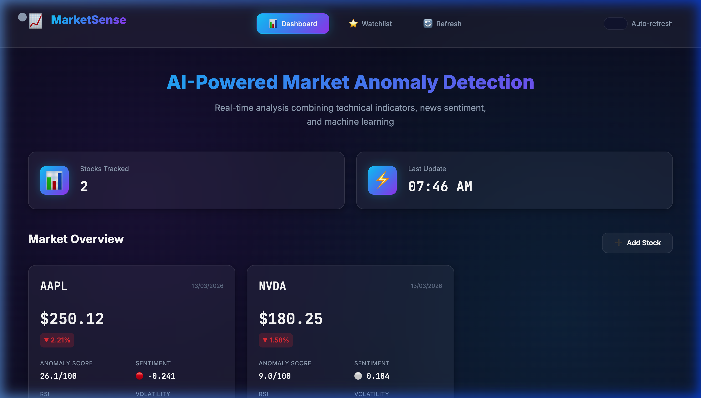
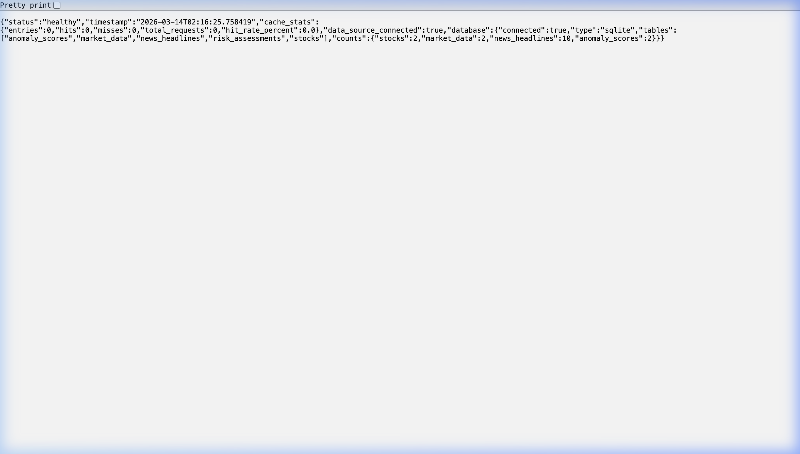

# MarketSense - AI-Powered Market Anomaly Detection 🧠📈

**MarketSense** is a high-performance financial intelligence system designed to detect market anomalies in real-time. By fusing **Technical Indicators** with **Real-time News Sentiment**, MarketSense identifies statistical outliers and breakout opportunities that traditional screeners miss.

---

## 🌐 Hosted Live Demo
The application is deployed on Render and verified to be fully functional.

**Live Dashboard:** [https://marketsense-v3-verified.onrender.com](https://marketsense-v3-verified.onrender.com)  
**API Status:** [https://marketsense-v3-verified.onrender.com/api/v1/health](https://marketsense-v3-verified.onrender.com/api/v1/health)

---

## 📸 Production Proofs
Verified production environment showing real-time telemetry and system health.

### AI-Powered Dashboard


### System Health & Database Stats


---

## 🚀 Key Features

*   **Multi-Modal AI Fusion**: Integrates price action, volume, and NLP-driven news sentiment.
*   **Anomaly Scoring (0-100)**: Uses an **Isolation Forest** ML model to quantify deviations from normal market behavior.
*   **Risk Assessment**: Automatically categorizes risk (Low/Medium/High) based on anomaly scores and volatility.
*   **Sentiment Engine**: Scrapes Google News and uses VADER sentiment analysis to gauge market mood.
*   **Real-time Dashboard**: Glassmorphic UI providing instant feedback on your watchlist.
*   **Automated Background Sync**: Managed scheduler ensures data is always fresh (15-min Market / 5-min News).

---

## 🛠️ Tech Stack & Architecture

- **Backend**: Python 3.10+, FastAPI
- **Database**: SQLite (Production-optimized for small-scale MVP) / SQLAlchemy
- **ML/Analytics**: Scikit-Learn (Isolation Forest), Pandas, NumPy
- **NLP**: VADER Sentiment Analysis
- **Frontend**: Vanilla JS, Glassmorphism CSS, Dynamic Components
- **Infrastructure**: Render.com (Auto-deploy, Background Scheduler)

---

## ⚡ Quick Start

### 1. Local Setup
```bash
# Clone the repository
git clone https://github.com/asthanameghna/aotc-mvp-marketsense.git
cd aotc-mvp-marketsense

# Install Dependencies
pip install -r requirements.txt

# Start the API & Dashboard
python main.py
```
*The dashboard will be available at http://localhost:8000*

### 2. Configure Watchlist
Edit `watchlist.txt` or use the UI to add tickers.
```text
AAPL
NVDA
TSLA
MSFT
```

---

## 📝 License
MIT License. Free for educational and research use.
Developed with ❤️ for Advanced Market Intelligence.
